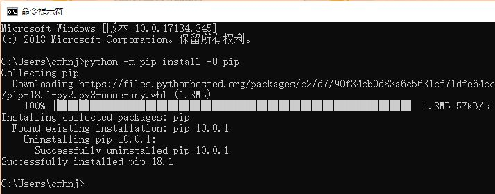

# Guide of  Building Software Environment for Beginners

https://github.com/PySEE/home/tree/S2019/guide/BuildingSoftwareEnvironment.md 

Firstly，You **MUST** setup the working directory for the course

https://github.com/PySEE/home/tree/S2019/guide/AdvWorkingDir.md

then,following the steps

* [A: Python](#A:Python) Python, Autopep8,Pylint,IDLE

* [B: Jupyter Notebook](#B:Jupyter):  Jupyter Notebook, PySEE/Home

* [C: Visual Studio Code](#C:VSCode): Markdown,Python
  
* [D: Git/Github](#D:Git): `Clone` PySEE/home

## A:Python

Goto the official Python site  https://www.python.org/downloads/ to download the suitable version Python，e.g.**Python for Windows**： https://www.python.org/downloads/windows/

Python 3.7.0 for Windows x86-64 executable installer 

https://www.python.org/ftp/python/3.7.0/python-3.7.0-amd64.exe

###  Customize Installation
      
* 1  Make sure you **check** option **Add Python 3.7 to PATH**

* 2  To change install location, click on **Customize installation** , then **Next** and enter **C:\python37** the item of  **Customize installation location**
            
 


   
### update pip to the most recent version

From a command prompt:

```bash
>python -m pip install -U pip 
```



#### NOTE: you may use the mirror site @ tsinghua  to install for the speed

```bash
>python -m pip install -U pip -i  https://pypi.tuna.tsinghua.edu.cn/simple
```

### Install Packages

The Python Package Index(PyPI) is a repository of software for the Python programming language.

https://pypi.org/

### Use **pip** to install packages

```bash
>pip  install packagename  
```
 use the mirror site  to install for the speed

```bash
>pip  install packagename  -i  mirrorsite  
``` 

install from the mirror site `@tsinghua`: https://pypi.tuna.tsinghua.edu.cn/simple

```bash
>pip  install packagename  -i  https://pypi.tuna.tsinghua.edu.cn/simple
```

* **Install autopep8, pylint**

```bash  
>pip install autopep8 -i  https://pypi.tuna.tsinghua.edu.cn/simple
>pip install pylint -i  https://pypi.tuna.tsinghua.edu.cn/simple
```

### Using IDLE


## B:Jupyter

### Install 
  
```bash       
>pip install jupyter  -i  https://pypi.tuna.tsinghua.edu.cn/simple
```    

### Using

```bash       
>jupyter notebook
```    


### Using the Jupyter Notebook of  PySEE/hone

* Go to the repo **home** on the Github: https://github.com/PySEE/home download `home.zip`


* Start Jupyter Notebook of the course
 
  unzip home.zip, run  **StartNB.bat**  under the dir **notebook**, start **Jupyter Notebook** server

## C:VSCode

### Install VS Code

  https://code.visualstudio.com/

### Install Python Extension

https://code.visualstudio.com/docs/languages/python

### Using VS Code


## D:Git

**`1`** Install Git for Windows: https://git-scm.com/download/win

**`2`** Clone the S2019 branch of the [home](https://github.com/PySEE/home) to your computer

```bash
>git clone --depth 1 -b S2019 https://github.com/PySEE/home.git
```