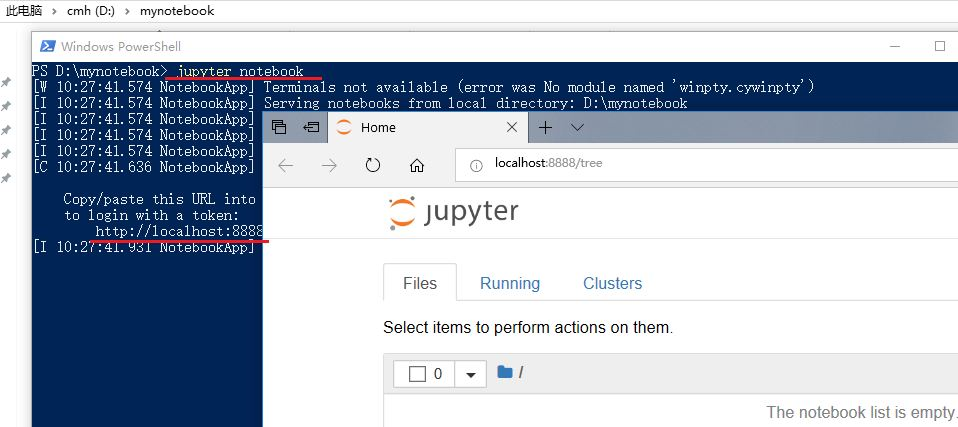
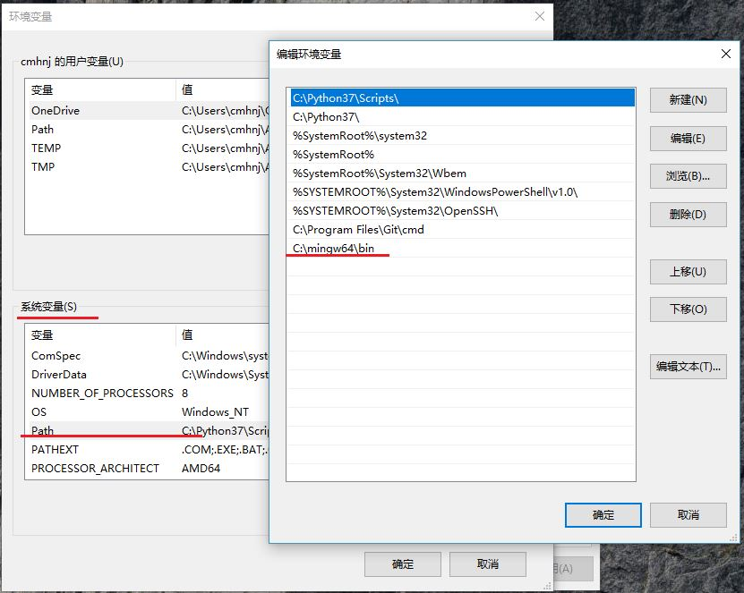

# Guide of  Building Software Environment for Beginners

Firstly，You **MUST** setup the working directory for the course

https://github.com/PySEE/home/tree/S2019/guide/AdvWorkingDir.md

then,following the steps

* [1: Python](#1:Python) Python, Autopep8,Pylint,IDLE

* [2: Jupyter Notebook](#2:Jupyter): Jupyter Notebook, PySEE/Home

* [3: MinGW-W64(GCC)](#3:MinGW-W64): MinGW-W64(`GCC`)

* [4: Visual Studio Code](#4:VSCode): Markdown,Python,C/C++
  
* [5: Git/Github](#5:Git): `Clone` PySEE/home

## 1:Python

Goto the official Python site  https://www.python.org/downloads/ to download the suitable version Python，e.g.**Python for Windows**： https://www.python.org/downloads/windows/

Python 3.7.0 for Windows x86-64 executable installer：
https://www.python.org/ftp/python/3.7.0/python-3.7.0-amd64.exe

###  1.1 Customize Installation Python
      
* 1  Make sure you **check** option **Add Python 3.7 to PATH**

* 2  To change install location, click on **Customize installation** , then **Next** and enter **C:\python37** the item of  **Customize installation location**
            
 


   

### 1.2 The Python Package Index(PyPI)

The Python Package Index(PyPI) is a repository of software for the Python programming language.: https://pypi.org/

`pip` is a package manage for Python. It makes installing and uninstalling Python packages

* Installing Python Modules : https://docs.python.org/3/installing/

**1.2.1 Install** 

The following command will install the latest version of a module and its dependencies from the Python Packaging Index:

```bash
>python -m pip install SomePackage  
```

Install the  multiple modules at the one `pip install` command

```bash
>python -m pip install SomePackage1  SomePackage2 
```

**1.2.2 Upgrading**
Normally, if a suitable module is already installed, attempting to install it again will have no effect. Upgrading existing modules must be requested **explicitly**:

```bash
>python -m pip install --upgrade SomePackage  
```
or

```bash
>python -m pip install -U SomePackage  
```

**1.2.3 Install from an alternate index**

```bash
>python -m pip install SomePackage  -i  the-url-of-an-alternate-index
``` 

Install from `@tsinghua` for the **higher speed**: https://pypi.tuna.tsinghua.edu.cn/simple 

```bash
>pip  install packagename  -i  https://pypi.tuna.tsinghua.edu.cn/simple
```

**1.2.4 set one alternate index site as the default site**

* if pip>10.0

```bash
>pip config set global.index-url https://pypi.tuna.tsinghua.edu.cn/simple
```

**1.2.5 uninstall**  

```bash
>pip uninstall packagename  
```

**1.2.6 Show help for commands**

```bash
>pip  help  
```

### 1.3 Install Packages

#### 1.3.1 update `pip` to the most recent version

```bash
>python -m pip install -U pip -i  https://pypi.tuna.tsinghua.edu.cn/simple
```


#### 1.3.2 set `tsinghua` as default site 

```bash
>pip config set global.index-url https://pypi.tuna.tsinghua.edu.cn/simple
```

#### 1.3.3 Install autopep8, pylint

```bash  
>python -m pip install autopep8 
>python -m pip install pylint
```

or

```bash  
>python -m pip install autopep8 pylint
```

### 1.4 Using IDLE


## 2:Jupyter

### 2.1 Install 
  
```bash       
>python -m pip install jupyter
```    

### 2.2 Using

```bash       
>jupyter notebook
```    


### 2.3 Literate programming your Jupyter Notebook in the `specific working folder`

* `2.3.1` make the specific folder for  your **Jupyter Notebook**,for example: `D:/mynotebook`

* `2.3.2` **Open a cmd window in the folder**:  If you're already in the folder you want, you do `Shift+[mouse right-click]` on the background of the Explorer window, then click on "Open command window here" or "Open PowerShell window here"

* `2.3.3` Enter `jupyter notebook` in cmd window of the folder,you will see the active jupyter server. the folder is the default  folder of your Jupyter Notebook 

    

     *  start **Jupyter Notebook** quickly 

         * `1` make the **"start.bat"** batch file with the content **`jupyter notebook`** through Windows's **notepad.exe**(记录本)  in the working folder of your Jupyter Notebook

         * `2` Double-click **`start.bat`**，Start **Jupyter Notebook**  server

  

### 2.4 Using the Jupyter Notebook of PySEE/home

**2.4.1** Go to the repo **home** on the Github: https://github.com/PySEE/home download `home.zip`


**2.4.21** Start Jupyter Notebook of the course
 
  unzip home.zip, double-click  `StartNB.bat`  under the folder of **notebook** to start **Jupyter Notebook** 

## 3:MinGW-W64

* 3.1 Goto MinGW mother site at：https://sourceforge.net/projects/mingw-w64/files/?source=navbar

    * sjlj: 32 and 64 bits,but it incurs a minor performance penalty
     
    * seh：64 bits only
  
  Download： **GCC 8.1.0 x86_64-win32-sjlj**
  
  

* 3.2 unzip the ziped MinGW-w64 to **C:\mingw64**

* 3.3 Add **C:\mingw64\bin** to the system environment variable **Path**

    For Windows 10: 

      start  "Windows Start Menu" ⇒ "Settings" ⇒ "About"(at the bottom) ⇒ "System Info"(scroll down)  ⇒ Switch to "Advanced System Settings"  ⇒  "Environment Variables"  ⇒  Choose "System Variables" (for all users) ⇒ Choose the System Variable "**Path**" ⇒ Choose "New" (add a new dir to  **Path** variable) > Enter the value: **C:\mingw64\bin**.



* 3.4 Verify the GCC installation by listing the version of gcc:
  ```bash
  > gcc --version
  ``` 

## 4:VSCode

Visual Studio Code is a lightweight but powerful source code editor which runs on your desktop and is available for Windows, macOS and Linux. It comes with built-in support for JavaScript, TypeScript and Node.js and has a rich ecosystem of extensions for other languages (such as C++, C#, Python, PHP, Go) and runtimes (such as .NET and Unity). 

### 4.1 Download and Install Visual Studio Code 
 
    https://code.visualstudio.com/

### 4.2 Install Python Extension

    https://code.visualstudio.com/docs/languages/python

### 4.3 Install the Microsoft C/C++ extension

    https://code.visualstudio.com/docs/languages/cpp

### 4.4 Using VS Code

#### 4.4.1 Python


####  4.4.2 C/C++


## 5:Git

**`5.1`** Install Git for Windows: https://git-scm.com/download/win

**`5.2`** Clone the S2019 branch of the [home](https://github.com/PySEE/home) to your computer

```bash
>git clone --depth 1 -b S2019 https://github.com/PySEE/home.git
```

## More

https://github.com/PySEE/home/tree/S2019/guide/BuildingSoftwareEnvironment.md 