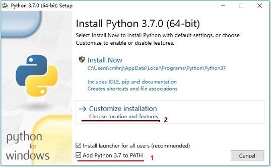
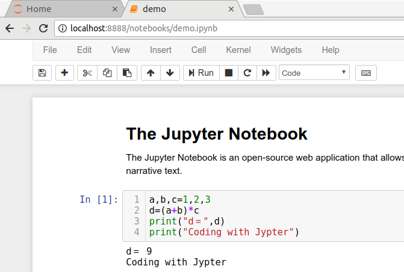

# The Guide of  Building Software Environment

Firstly，You **MUST** setup the working directory for the course

https://github.com/PySEE/home/tree/S2019/guide/AdvWorkingDir.md

<!-- TOC -->

- [The Guide of  Building Software Environment](#the-guide-of--building-software-environment)
    - [A:Python](#apython)
        - [A.1 Customize Installation Python](#a1-customize-installation-python)
        - [A.2 The Python Package Index(PyPI)](#a2-the-python-package-indexpypi)
        - [A.3 Install Packages](#a3-install-packages)
            - [A.3.1 update `pip` to the most recent version](#a31-update-pip-to-the-most-recent-version)
            - [A.3.2 set `tsinghua` as default site](#a32-set-tsinghua-as-default-site)
            - [A.3.3 Install autopep8, pylint](#a33-install-autopep8-pylint)
    - [B:Jupyter](#bjupyter)
        - [B.1 Install](#b1-install)
        - [B.2 Using](#b2-using)
        - [B.3 Literate programming your Jupyter Notebook in the `specific working folder`](#b3-literate-programming-your-jupyter-notebook-in-the-specific-working-folder)
        - [B.4 Using the Jupyter Notebook of PySEE/home](#b4-using-the-jupyter-notebook-of-pyseehome)
    - [C:MinGW-W64](#cmingw-w64)
    - [D:VSCode](#dvscode)
        - [D.1 Download and Install Visual Studio Code](#d1-download-and-install-visual-studio-code)
        - [D.2 Install Python Extension](#d2-install-python-extension)
        - [D.3 Install the Microsoft C/C++ extension](#d3-install-the-microsoft-cc-extension)
        - [D.4 Using VS Code](#d4-using-vs-code)
            - [D.4.1 Python](#d41-python)
            - [D.4.2 C/C++](#d42-cc)
    - [E:Git](#egit)
    - [F:Scientific Computation Packages](#fscientific-computation-packages)
        - [F.1 Scipy](#f1-scipy)
        - [F.2 IAPWS-IF97 Packages](#f2-iapws-if97-packages)
            - [F.2.1 iapws](#f21-iapws)
            - [F.2.2 SEUIF97](#f22-seuif97)
    - [Extended](#extended)
    - [References](#references)

<!-- /TOC -->

## A:Python

Goto the official Python site  https://www.python.org/downloads/ to download the suitable version Python，e.g.**Python for Windows**： https://www.python.org/downloads/windows/

Python 3.7.0 for Windows x86-64 executable installer：
https://www.python.org/ftp/python/3.7.0/python-3.7.0-amd64.exe

### A.1 Customize Installation Python
      
* 1  Make sure you **check** option **Add Python 3.7 to PATH**

* 2  To change install location, click on **Customize installation** , then **Next** and enter **C:\python37** the item of  **Customize installation location**
            
 



   
* 3 Using IDLE


### A.2 The Python Package Index(PyPI)

The Python Package Index(PyPI) is a repository of software for the Python programming language.: https://pypi.org/

`pip` is a package manage for Python. It makes installing and uninstalling Python packages

* Installing Python Modules : https://docs.python.org/3/installing/

**A.2.1 Install** 

The following command will install the latest version of a module and its dependencies from the Python Packaging Index:

```bash
>python -m pip install SomePackage  
```

Install the  multiple modules at the one `pip install` command

```bash
>python -m pip install SomePackage1  SomePackage2 
```

**A.2.2 Upgrading**
Normally, if a suitable module is already installed, attempting to install it again will have no effect. Upgrading existing modules must be requested **explicitly**:

```bash
>python -m pip install --upgrade SomePackage  
```
or

```bash
>python -m pip install -U SomePackage  
```

**A.2.3 Install from an alternate index**

```bash
>python -m pip install SomePackage  -i  the-url-of-an-alternate-index
``` 

Install from `@tsinghua` for the **higher speed**: https://pypi.tuna.tsinghua.edu.cn/simple 

```bash
>pip  install packagename  -i  https://pypi.tuna.tsinghua.edu.cn/simple
```

**A.2.4 set one alternate index site as the default site**

* if pip>10.0

```bash
>pip config set global.index-url https://pypi.tuna.tsinghua.edu.cn/simple
```

**A.2.5 uninstall**  

```bash
>pip uninstall packagename  
```

**A.2.6 Show help for commands**

```bash
>pip  help  
```

### A.3 Install Packages

#### A.3.1 update `pip` to the most recent version

```bash
>python -m pip install -U pip -i  https://pypi.tuna.tsinghua.edu.cn/simple
```


#### A.3.2 set `tsinghua` as default site 

```bash
>pip config set global.index-url https://pypi.tuna.tsinghua.edu.cn/simple
```

#### A.3.3 Install autopep8, pylint

```bash  
>python -m pip install autopep8 
>python -m pip install pylint
```

or

```bash  
>python -m pip install autopep8 pylint
```

## B:Jupyter

### B.1 Install 
  
```bash       
>python -m pip install jupyter
```    

### B.2 Using

```bash       
>jupyter notebook
```    




### B.3 Literate programming your Jupyter Notebook in the `specific working folder`

* `B.3.1` make the specific folder for  your **Jupyter Notebook**,for example: `D:/mynotebook`

* `B.3.2` **Open a cmd window in the folder**:  If you're already in the folder you want, you do `Shift+[mouse right-click]` on the background of the Explorer window, then click on "Open command window here" or "Open PowerShell window here"

* `B.3.3` Enter `jupyter notebook` in cmd window of the folder,you will see the active jupyter server. the folder is the default  folder of your Jupyter Notebook 

    

* `B.3.4`  start **Jupyter Notebook** quickly 

   * `1` make the **"start.bat"** batch file with the content **`jupyter notebook`** through Windows's **notepad.exe**(记录本)  in the working folder of your Jupyter Notebook

   * `2` Double-click **`start.bat`**，Start **Jupyter Notebook**  server

  

### B.4 Using the Jupyter Notebook of PySEE/home

pre-installed:Python3 and Jupyter Notebook

**B.4.1** Go to the repo **home** on the Github: https://github.com/PySEE/home download `home.zip`


**B.4.2** Start Jupyter Notebook of the course
 
  unzip home.zip, double-click  `StartNB.bat`  under the folder of **notebook** to start **Jupyter Notebook** 

## C:MinGW-W64

* C.1 Goto MinGW mother site at：https://sourceforge.net/projects/mingw-w64/files/?source=navbar

    * sjlj: 32 and 64 bits,but it incurs a minor performance penalty
     
    * seh：64 bits only
  
  Download： **GCC 8.1.0 x86_64-win32-sjlj**
  
  

* C.2 unzip the ziped MinGW-w64 to **C:\mingw64**

* C.3 Add **C:\mingw64\bin** to the system environment variable **Path**

   For Windows 10: 

   start  "Windows Start Menu" ⇒ "Settings" ⇒ "About"(at the bottom) ⇒ "System Info"(scroll down)  ⇒ Switch to "Advanced System Settings"  ⇒  "Environment Variables"  ⇒  Choose "System Variables" (for all users) ⇒ Choose the System Variable "**Path**" ⇒ Choose "New" (add a new dir to  **Path** variable) > Enter the value: **C:\mingw64\bin**.


* C.4 RENAME `C:\mingw64\bin\mingw32-make.exe` to  `C:\mingw64\bin\make.exe`

* C.5 Verify the GCC installation by listing the version of gcc:
  ```bash
  > gcc --version
  ``` 

## D:VSCode

Visual Studio Code is a lightweight but powerful source code editor which runs on your desktop and is available for Windows, macOS and Linux. It comes with built-in support for JavaScript, TypeScript and Node.js and has a rich ecosystem of extensions for other languages (such as C++, C#, Python, PHP, Go) and runtimes (such as .NET and Unity). 

### D.1 Download and Install Visual Studio Code 
 
    https://code.visualstudio.com/

### D.2 Install Python Extension

    https://code.visualstudio.com/docs/languages/python

### D.3 Install the Microsoft C/C++ extension

    https://code.visualstudio.com/docs/languages/cpp

### D.4 Using VS Code

#### D.4.1 Python


#### D.4.2 C/C++


## E:Git

**`E.1`** Install Git for Windows: https://git-scm.com/download/win

**`E.2`** Clone the S2019 branch of the [home](https://github.com/PySEE/home) to your computer

```bash
>git clone --depth 1 -b S2019 https://github.com/PySEE/home.git
```

## F:Scientific Computation Packages

### F.1 Scipy
   
   Numpy,Scipy, Matplotlib https://www.scipy.org/install.html 

```bash       
> python -m pip install numpy scipy matplotlib
``` 

### F.2 IAPWS-IF97 Packages

#### F.2.1 iapws

pre-installed:numpy and scipy

```bash       
> python -m pip install iapws 
``` 

#### F.2.2 SEUIF97

```bash       
> python -m pip install seuif97 
``` 

## Extended

https://github.com/PySEE/home/tree/S2019/guide/BuildingSoftwareEnvironment-Exdended.md 

## References

* 1 Python3:  https://www.python.org/downloads/
  
  * Guido van Rossum. Python Tutorial. https://docs.python.org/3/tutorial/index.html

* 2 Python Packages

  * Jupyter: http://jupyter.org/
    
     * Documentation. http://jupyter.readthedocs.org/en/latest/

  * Numpy、Scipy and Matplotlib http://www.scipy.org/ 

     * Scipy. http://www.scipy.org/

     * Numpy. http://www.numpy.org/
  
     * Matplotlib.  http://matplotlib.org/

  * IAPWS-IF97:

     * Shared Lib: https://github.com/PySEE/SEUIF97

     * Python: https://github.com/jjgomera/iapws
 
* 3 Visual Studio Code：https://code.visualstudio.com/

   * Documentation: https://code.visualstudio.com/docs

   * **Markdown** and VS Code： https://code.visualstudio.com/docs/languages/markdown

   * Getting Started with **Python** https://code.visualstudio.com/docs/python/python-tutorial

   * **C/C++** for VS Code： https://code.visualstudio.com/docs/languages/cpp

   * **Git** Version Control in VS Code：https://code.visualstudio.com/docs/editor/versioncontrol

* 4 GCC, the GNU Compiler Collection：http://gcc.gnu.org/

   * MinGW-W64(GCC) Compiler Suite: GCC for Windows 64 & 32 bits：http://mingw-w64.org/

   * GCC and Make：Compiling, Linking and Building C/C++ Applications http://www3.ntu.edu.sg/home/ehchua/programming/cpp/gcc_make.html

* 5 Git for Windows:  https://github.com/git-for-windows/git/releases

