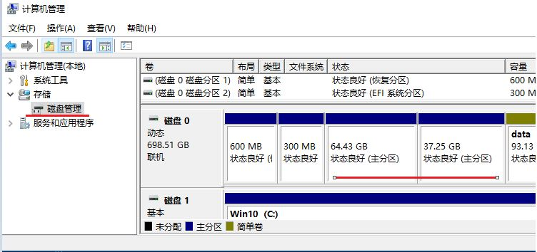
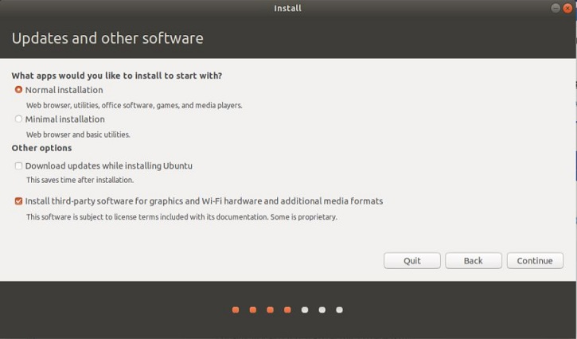
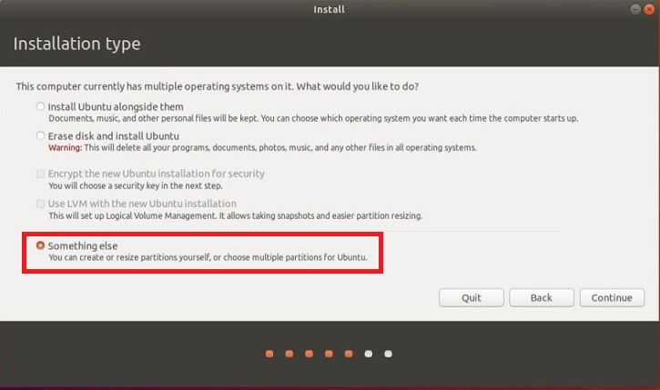
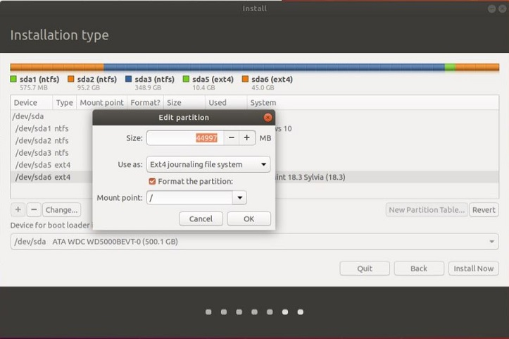
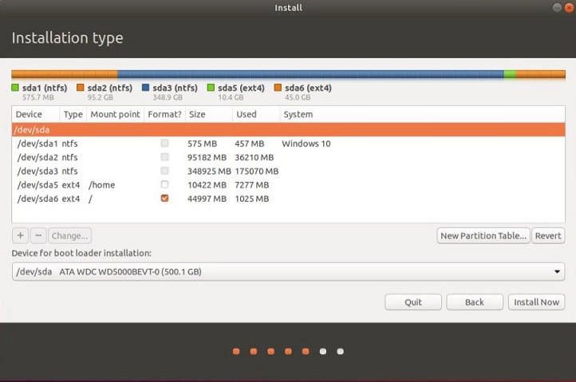

# Ubuntu系统安装和Python,C/C++开发环境的建立

在已安装Windows系统的电脑上，安装Ubuntu系统的过程简介
   
## 一、 准备安装Ubuntu系统需要的空闲硬盘空间

在Windows环境下，从`空余`的硬盘空间中划出一个`空的独立分区`，给Ubuntu使用。

为了学习工作方便，建议空间稍大些，如：50G



## 二、 准备Ubuntu安装U盘

* 从Ubuntu官网下载Ubuntn 18.04 LTS的iso文件

   https://www.ubuntu.com/download/desktop

   BitTorrent enables higher download speeds and more reliable downloads of large files.

   http://releases.ubuntu.com/18.04/ubuntu-18.04-desktop-amd64.iso.torrent

* 从 http://rufus.akeo.ie/  下载rufus，制作安装系统用U盘，然后，用U盘安装双系统

>可选Ubuntu系统
>
>Ubuntu发行版很多，建议**新手**使用
>
>* 1 “中国味”的UbuntuKylin: http://www.ubuntukylin.com/.  UbuntuKylin默认安装中文支持：预安装有WPS，搜狗拼音输入法等
> * 2 Linux Mint：https://www.linuxmint.com/。Linux Mint易用性高。但是英文系统系统安装后，需要补充安装中文包及其输入法(如：搜狗输入法)。Linux Mint有多个不同桌面环境的版本，如果电脑性能弱，建议是Linux Mint Xfce版。

## 三、 安装Ubuntu

安装的详细过程可参考网络上的文档。下面给出需要注意的要点。

* 1 Welcome界面：选择语言 **English**

* 2 Wireless界面：选择 **不连接无线网络** 

* 3 updates and other softwares: 选择 **安装第三方软件**



* **4 Installation type界面: 选择 `something else` (关键项目：安装类型一定选择为`something else`)**



然后，在 **`空闲空间`** 中定义`/home挂载点和分区`和`/系统分区和挂载点`点.(注意：一定要确定使用的是`空闲空间`，不要破坏Windows系统及其用户使用的空间）.

* **/home**： home挂载点和分区：从**空闲空间**中划分出一个“logic”分区， 作为 /home 挂载点
  * **注意**: 
    * 是 **“logic”** 分区，因为一个硬盘可划分的主分区数量有限；
    * 一定要有**home**挂载点和分区。如重新安装ubuntu， 仍将这个分区挂载在home下，不要格式化该分区，原来系统中的用户文件都能保留 

* **/**： 系统挂载点和分区：将余下空闲空间都划 “/” 分区，作为系统挂载点。 如果重新安装其他版本Liunx，将这个分区格式化.







定义挂载点和分好区，点`安装`前,再次确认使用的是`空闲空间`，不要破坏Windows系统及其用户使用的空间。

确认无误后，点`安装`,进入以下步骤：

* 5 Where are you:选择时区为 **shanghai**

* 6 Who are you: 用户名和密码，选择自动登录

   * 如是重装Ubuntu系统且要使用 **`原home`分区**, 用 **`原用户名`**


## 四、建立开发环境

### 1 Version Control: Git

```bash 
$sudo apt install git
```

### 2 C/C++ With GCC

Ubuntu系统内置GCC编译器，无需安装

### 3 Python3开发环境

Ubuntu 18.04 LTS系统中,默认Python3.但不完整，需补充: pip3、idle3。

在线安装：
```bash
$sudo apt install python3-pip
$sudo -H python3 -m  pip install  --upgrade pip 
$sudo apt install idle3
```
Python3相关命令都加3，如：

```bash
$python3 
$idle3
$pip3
```
### 4 安装scipy

apt在线安装
```bash
$sudo apt install python3-numpy python3-scipy python3-matplotlib
```
### 5 安装Jupyter

```bash
$sudo -H pip3 install jupyter -i  https://pypi.tuna.tsinghua.edu.cn/simple
```
### 6 安装IAPWS-IF97

#### SEUIF97

```bash
$sudo -H python3 -m pip install seuif97
```
#### IAPWS

```bash
$sudo -H pip3 install iapws
```
### 7 Visual Studio Code开发环境

#### 1 安装Visual Studio Code

From   https://code.visualstudio.com/docs/?dv=linux64_deb  download VS Code for Debian,Ubuntu

```bash
$sudo dpkg -i [vscode filename].deb
```

#### 2 安装插件

Install Python Extension in  Visual Studio Code

* https://code.visualstudio.com/docs/languages/python

Install the Microsoft C/C++ extension

* https://code.visualstudio.com/docs/languages/cpp

#### 4 set Python3 as the default Python Version

```json
// Path to Python, you can use a custom version of Python by modifying this setting to include the full path.
  "python.pythonPath": "python3",
```

### 8 科学计算包GSL

```bash
$sudo apt install gsl-bin
 
$sudo apt install libgsl-dev

```
### 9 数据可视化包Gnuplot

```bash
$sudo apt install gnuplot
```

## 六、英文版Ubuntu补充中文支持)

> **Note:** 以下方法适用于Xubunt的。不同版本ubuntu差别，可上网查询方法。

### 1 安装中文语言支持包

安装后，重新启动，联网状态下,在出现“Update information”->Incomplete language Support提示时
，点“Run this action now”，在线安装English和Chinese 包

> 或者以后：
>System->language support，选择和安装需要的语言包：English和Chinese，
> 

### 2 选择fcitx

安装软件后,退出当前登录(logout)，然后再登入,选择`keyboard input methods system`默认输入法系统`fcitx：setting->language support`,选择：`fcitx`

### 3 安装搜狗拼音输入法

从搜狗官网下载最新版的搜狗拼音输入法，安装

```bash
$sudo dpkg -i [sogoupinyinfilename].deb
```
如果安装失败(提示缺少依赖)，在终端执行
```bash
$sudo apt-get -f install
```
### 4 配置搜狗拼音输入法为系统中文输入方法

安装搜狗拼音输入法,退出当前登录(logout)，然后再登入（login)，就可以使用搜狗拼音输入法了

查看和配置系统的输入法： `setting->fcitx configuration`

### 5 中英文输入法切换

ctrl+space bar

## 七、安装Ubuntu系统到U盘

Ubuntu可以和安装到计算机硬盘一样，安装到U盘，成为便携的Ubuntu操作系统。

其安装步骤和安装到计算机硬盘分区一样，不同的是安装 **`“位置”`** 参数：

*  Ubuntu各分区挂载到U盘；U盘为`boot loader`设备；

**建议：** 1) 使用高品质的USB3.0 U盘；盘容量较大(>=32G); 2) 在U盘上建一个FAT32文件系统分区，用于兼容Windows文件。

## Reference

* How to install and Get Started with Ubuntu Desktop 16.04LTS  http://www3.ntu.edu.sg/home/ehchua/programming/howto/Ubuntu_HowTo.html

* Programmer's Survival Guide for Mac & Ubuntu  http://www3.ntu.edu.sg/home/ehchua/programming/howto/Unix_SurvivalGuide.html

* Linux Mint Guide(中文版） https://linuxmint.com/documentation/user-guide/Cinnamon/chinese_16.0.pdf

* The Linux Mint Installation Guide https://linuxmint-installation-guide.readthedocs.io/en/latest/index.html

